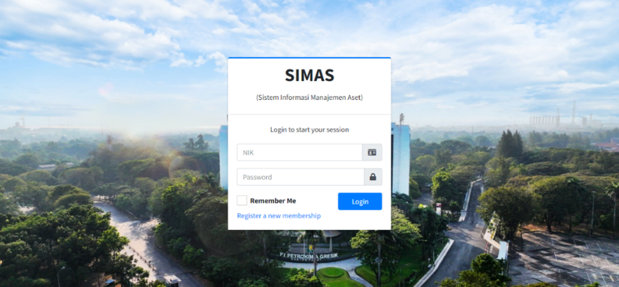
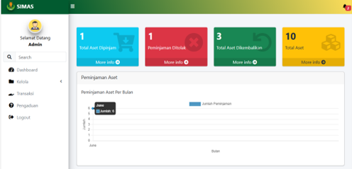
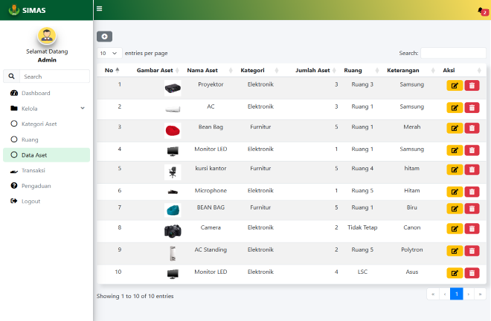
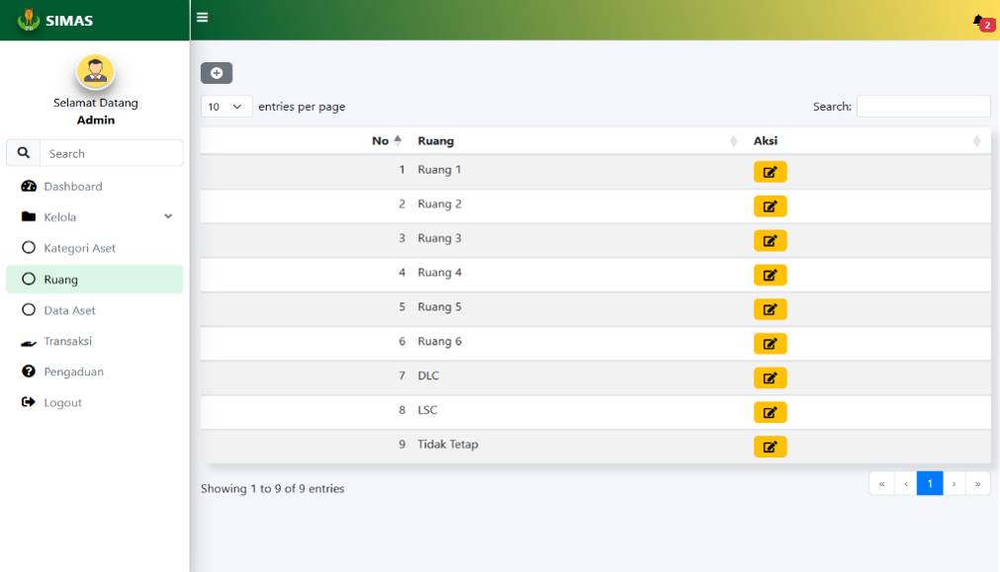
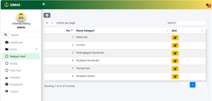
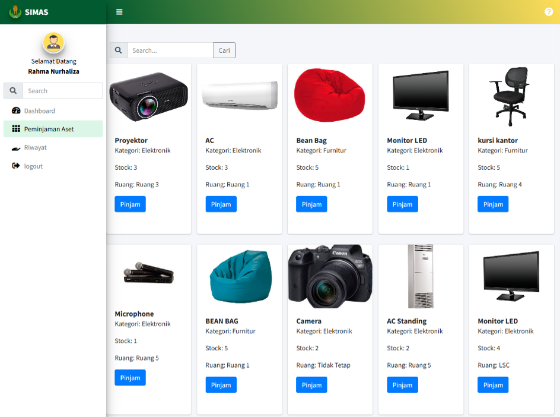
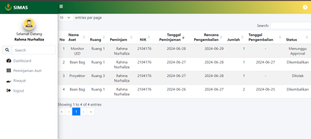
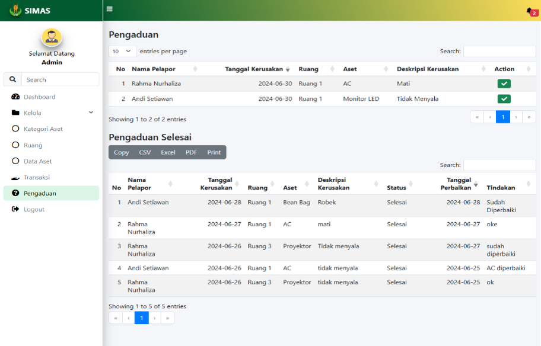

<div align="center">

# 🏢 Sistem Manajemen Aset

### Asset Management Information System

<p align="center">
  
</p>


---

**Website Sistem Manajemen Aset berbasis Laravel untuk membantu pengelolaan aset perusahaan secara digital.**

</div>

---

# 📑 Table of Contents

- [📖 About Project](#-about-project)
- [🎯 System Objectives](#-system-objectives)
- [👥 User Roles](#-user-roles)
- [✨ Features](#-features)
- [🖼️ Application Preview](#️-application-preview)
- [🛠️ Tech Stack](#️-tech-stack)
- [📂 Project Structure](#-project-structure)
- [⚙️ Installation Guide](#️-installation-guide)
- [🗄️ Database Setup](#️-database-setup)
- [🔑 Demo Account](#-demo-account)
- [👩‍💻 Author](#-author)

---

# 📖 About Project

Sistem Manajemen Aset merupakan aplikasi berbasis web yang dikembangkan menggunakan **Laravel Framework** untuk membantu proses pengelolaan aset perusahaan secara lebih efektif dan terdokumentasi.

Aplikasi ini mendukung proses pencatatan aset, pengelolaan ruangan, transaksi peminjaman dan pengembalian aset, pelaporan kerusakan aset, notifikasi, hingga pembuatan laporan.

Project ini dikembangkan saat menjalani **Internship di PT Petrokimia Gresik** pada Departemen **Manajemen & Pengembangan SDM**.

---

# 🎯 System Objectives

Website ini dikembangkan untuk:

- 📦 Mengelola data aset pada setiap ruangan
- 🏢 Mempermudah monitoring aset perusahaan
- 🔄 Mengelola transaksi peminjaman dan pengembalian aset
- 🔧 Mengelola laporan kerusakan aset
- 📄 Mendokumentasikan seluruh aktivitas aset secara digital
- 📊 Menyediakan laporan aset secara cepat

---

# 👥 User Roles

| Role | Description |
|------|-------------|
| 👑 Administrator | Mengelola seluruh data aset, kategori, ruangan, transaksi, dan laporan |
| 👤 User | Melihat aset, mengajukan peminjaman aset, serta membuat laporan kerusakan |
| 🔧 Helpdesk | Mengelola dan menangani laporan kerusakan aset |

---

# ✨ Features

## 🔐 Authentication

- Login
- Logout
- Multi User Role

---

## 📦 Asset Management

- Create Asset
- Update Asset
- Delete Asset
- Asset Detail
- Asset Search

---

## 🏢 Room Management

- Create Room
- Update Room
- Delete Room

---

## 📂 Category Management

- Create Category
- Update Category
- Delete Category

---

## 🔄 Asset Transaction

- Asset Borrowing
- Borrow Approval
- Asset Return
- Return Approval

---

## 🔧 Damage Report

- Report Asset Damage
- Damage Status
- Repair Monitoring

---

## 🔔 Notification

- Borrow Notification
- Return Notification
- Damage Notification

---

## 📊 Report

- Asset Report
- Damage Report
- Borrowing Report

---

# 🖼️ Application Preview

## 🔐 Login

<p align="center">

</p>

---

## 📊 Dashboard

<p align="center">

</p>

---

## 📦 Asset Management

<p align="center">

</p>

---

## 🏢 Room Management

<p align="center">

</p>

---

## 📂 Category Management

<p align="center">

</p>

---

## 🔄 Borrowing Asset

<p align="center">

</p>

---

## 📥 Asset Return

<p align="center">

</p>

---

## 🔧 Damage Report

<p align="center">

</p>


# 🛠️ Tech Stack

| Technology | Description |
|------------|------------|
| Laravel | Backend Framework |
| PHP | Programming Language |
| MySQL | Database |
| Bootstrap | CSS Framework |
| HTML5 | Frontend |
| CSS3 | Styling |
| JavaScript | Frontend Interaction |
| XAMPP | Local Server |
| Visual Studio Code | Code Editor |

---

# 📂 Project Structure

```
Sistem-Manajemen-Aset
│
├── app
├── bootstrap
├── config
├── database
├── public
├── resources
├── routes
├── storage
├── screenshots
├── artisan
├── composer.json
├── package.json
└── README.md
```

---

# ⚙️ Installation Guide

## ✅ Requirements

Pastikan telah menginstal:

- PHP 8+
- Composer
- XAMPP
- MySQL
- Git
- Visual Studio Code

---

## 📥 Clone Repository

```bash
git clone https://github.com/USERNAME/Sistem-Manajemen-Aset.git
```

Masuk ke folder project

```bash
cd Sistem-Manajemen-Aset
```

---

## 📦 Install Dependency

```bash
composer install
```

---

## 🔑 Copy Environment

```bash
cp .env.example .env
```

Jika menggunakan Windows

```bash
copy .env.example .env
```

---

## 🔑 Generate Application Key

```bash
php artisan key:generate
```

---

## ⚙️ Configure Database

Buka file `.env`

Ubah konfigurasi berikut

```env
DB_CONNECTION=mysql
DB_HOST=127.0.0.1
DB_PORT=3306
DB_DATABASE=simas
DB_USERNAME=root
DB_PASSWORD=
```

---

# 🗄️ Database Setup

Jalankan XAMPP

Pastikan:

- Apache ✅
- MySQL ✅

Kemudian buka

```
http://localhost/phpmyadmin
```

Buat database baru

```
simas
```

Kemudian jalankan

```bash
php artisan migrate
```

Lalu isi data awal

```bash
php artisan db:seed --class=UsersSeeders
```

Apabila menggunakan file SQL, import file berikut melalui phpMyAdmin:

```
database/simas.sql
```

---

## ▶️ Run Project

```bash
php artisan serve
```

Buka browser

```
http://127.0.0.1:8000
```

# 🌟 Future Development

Beberapa pengembangan yang dapat dilakukan pada sistem ini:

- 📱 Responsive Mobile UI
- 📧 Email Notification
- 📊 Dashboard Analytics
- 📷 QR Code Asset
- 📍 Asset Tracking
- ☁️ Cloud Deployment

---

# 👩‍💻 Author

<div align="center">

## Rahma Nurhaliza

**Fresh Graduate Informatics Engineering**

Terima kasih telah mengunjungi repository ini. ⭐

</div>
